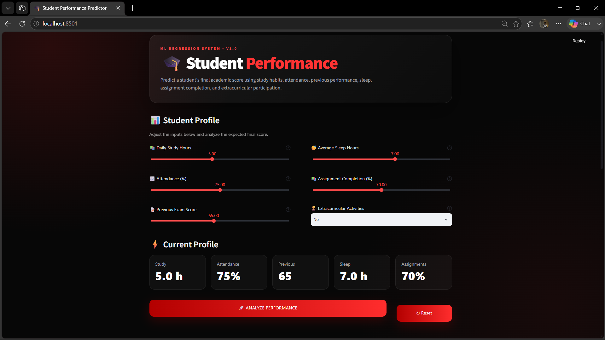
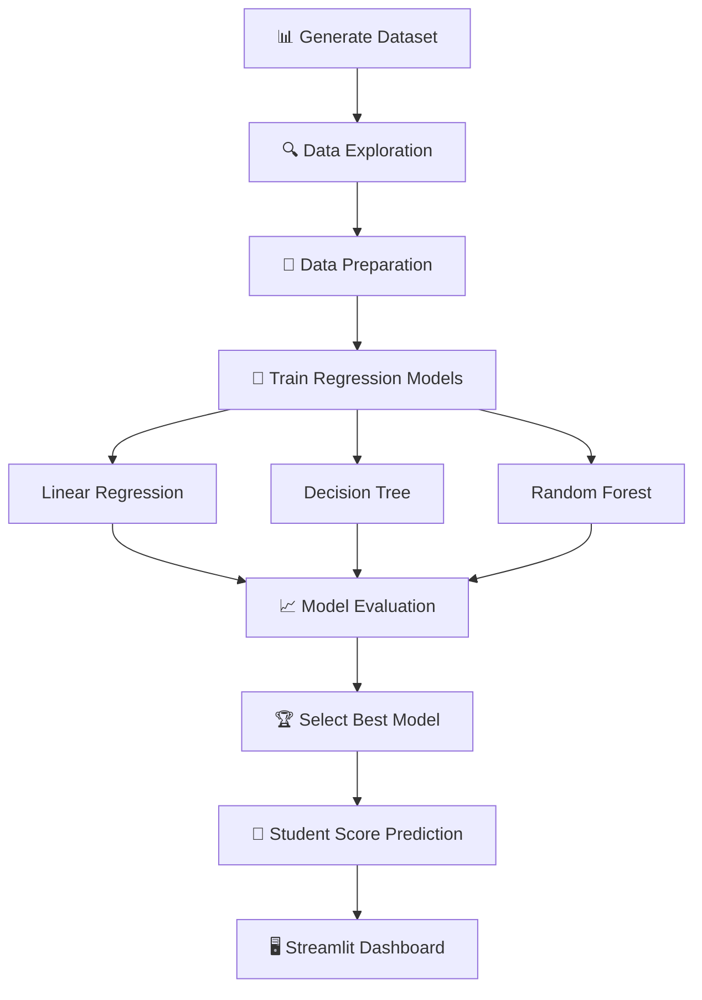

# 🎓 Student Performance Predictor

<p align="center">

**Machine Learning powered academic performance prediction**

Predict a student's final academic score using academic and lifestyle features.

Built with **Python • Scikit-Learn • Streamlit**

</p>

<p align="center">


</p>

---

## 🚀 Overview

**Student Performance Predictor** is a Machine Learning regression project designed to estimate a student's final academic score from academic and lifestyle-related factors.

The project follows a complete ML workflow:

**Data Generation → Data Analysis → Model Training → Model Evaluation → Prediction → Streamlit Deployment**

The application provides an interactive dashboard where users can enter student information and receive an estimated final score.

---

## ✨ Features

- 📊 Synthetic dataset containing **1,000 student records**
- 🔍 Exploratory Data Analysis
- 🧹 Data validation and preprocessing
- 🤖 Multiple Machine Learning regression algorithms
- 📈 Model performance comparison
- 🏆 Best-model selection
- 🎯 Individual student score prediction
- 🖥️ Interactive Streamlit dashboard
- 💾 Trained model saved using Joblib
- 📱 Clean and responsive dark-themed UI

---

## 📌 Model Results

| Metric | Result |
|---|---:|
| 🏆 Best Model | **Linear Regression** |
| MAE | **2.91** |
| RMSE | **3.69** |
| R² Score | **87.85%** |

The **Linear Regression** model achieved the best overall performance among the tested models.

---

## 🧠 Machine Learning Models

Three regression algorithms were evaluated:

| Model | MAE | RMSE | R² |
|---|---:|---:|---:|
| **Linear Regression** | **2.91** | **3.69** | **0.8785** |
| Random Forest | 3.53 | 4.44 | 0.8244 |
| Decision Tree | 4.92 | 6.07 | 0.6719 |

### 🏆 Selected Model

**Linear Regression**

- **MAE:** 2.91
- **RMSE:** 3.69
- **R²:** 0.8785

---

## 📊 Input Features

The model uses six features:

| Feature | Description |
|---|---|
| `study_hours` | Average daily study hours |
| `attendance` | Attendance percentage |
| `previous_score` | Previous examination score |
| `sleep_hours` | Average daily sleep |
| `assignment_completion` | Assignment completion percentage |
| `extracurricular` | Participation in extracurricular activities |

### 🎯 Target

```text
final_score
```

The predicted score is constrained to a range of **0–100** in the application.

---

## 🛠️ Tech Stack

| Category | Technologies |
|---|---|
| Programming | Python |
| Data Science | Pandas, NumPy |
| Machine Learning | Scikit-Learn |
| Models | Linear Regression, Decision Tree, Random Forest |
| Visualization | Matplotlib, Seaborn |
| Model Persistence | Joblib |
| Application | Streamlit |

---

## 📁 Project Structure

```text
STUDENT-PERFORMANCE-ML/
│
├── app/
│   └── app.py
│
├── data/
│   ├── generate_data.py
│   └── student_performance.csv
│
├── models/
│   └── student_performance_model.pkl
│
├── notebooks/
│   └── student_performance.ipynb
│
├── src/
│   └── predict.py
│
├── screenshots/
│   └── dashboard.png
│
├── .gitignore
├── requirements.txt
└── README.md
```

---

## ⚙️ Installation

### 1. Clone the repository

```bash
git clone https://github.com/shahedkhanin-dev/Student-Performance-ML.git
cd Student-Performance-ML
```

### 2. Create a virtual environment

```bash
python -m venv venv
```

### 3. Activate the environment

**Windows:**

```powershell
venv\Scripts\activate
```

**macOS / Linux:**

```bash
source venv/bin/activate
```

### 4. Install dependencies

```bash
pip install -r requirements.txt
```

---

## ▶️ Run the Application

Start the Streamlit application:

```bash
streamlit run app/app.py
```

The application will open at:

```text
http://localhost:8501
```

---

## 🖥️ Application

The Streamlit dashboard allows users to enter:

- 📚 Daily study hours
- 📈 Attendance
- 📝 Previous exam score
- 😴 Sleep hours
- 📚 Assignment completion
- 🏆 Extracurricular participation

After clicking **Analyze Performance**, the application displays:

- 🎯 Predicted final score
- 📊 Performance status
- 🧠 Model information
- 📈 MAE
- 📉 RMSE
- 📌 R² score
- 🔍 Prediction input summary

### Dashboard

<p align="center">
  
</p>

---

## 🔬 Machine Learning Workflow



---

## 📈 Evaluation Metrics

### MAE — Mean Absolute Error

Measures the average absolute difference between predicted and actual scores.

**Lower is better.**

### RMSE — Root Mean Squared Error

Measures prediction error while giving greater weight to larger errors.

**Lower is better.**

### R² — Coefficient of Determination

Measures how well the model explains the variation in the target variable.

**Higher is better.**

### Final Model Performance

```text
MAE  → 2.91
RMSE → 3.69
R²   → 0.8785
```

---

## 💡 Example Prediction

Example student profile:

```text
Study Hours            → 5.0
Attendance             → 75%
Previous Score         → 65
Sleep Hours            → 7.0
Assignment Completion  → 70%
Extracurricular        → No
```

The model generates an estimated final score based on these features.

---

## 🔮 Future Improvements

- 🌐 Deploy the application online
- 📊 Add interactive performance visualizations
- 🔎 Add model explainability
- 📚 Train using larger real-world datasets
- 🤖 Experiment with additional regression algorithms
- 📈 Add personalized improvement recommendations
- 🔐 Add user authentication
- 📱 Improve mobile responsiveness

---

## ⚠️ Disclaimer

This project is intended for **educational and demonstration purposes**.

The dataset is synthetic and predictions should not be used for real-world academic decision-making.

---

## 👨‍💻 Author

### Mohammed Shahed Afrid Khan

**Machine Learning • Artificial Intelligence • Python • Data Science**

GitHub:  
https://github.com/shahedkhanin-dev

---

## ⭐ Support

If you found this project useful or interesting, consider giving the repository a ⭐.

<p align="center">

**Built with Python, Scikit-Learn & Streamlit**

</p>
